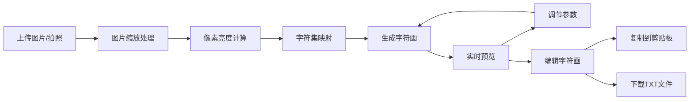

## 1. 产品概述

字符画生成器是一个在线工具，将用户上传的图片或摄像头拍摄的照片转换为ASCII字符艺术。用户可以调节多种参数实时预览效果，支持在线编辑、一键复制和文件下载。

- **主要用途**：快速生成个性化ASCII字符画，用于社交分享、艺术创作、复古风格设计
- **目标用户**：设计爱好者、程序员、社交媒体用户、复古艺术爱好者
- **产品价值**：提供简单易用、视觉精美的字符画生成体验，支持实时调节和多端输出

## 2. 核心功能

### 2.1 功能模块
1. **主页面**：图片上传区、字符画预览区、控制面板、工具栏
2. **图片输入模块**：文件上传、拖拽上传、摄像头拍照
3. **参数控制模块**：字符集选择、宽度调节、对比度调节、反色开关
4. **预览编辑模块**：实时预览、字符画文本编辑
5. **输出模块**：一键复制、TXT文件下载

### 2.2 页面详情

| 页面名称 | 模块名称 | 功能描述 |
|---------|---------|---------|
| 主页面 | 头部标题区 | 品牌标题、副标题、装饰性字符画图案 |
| 主页面 | 图片输入区 | 文件上传按钮、拖拽上传区域、摄像头拍照按钮 |
| 主页面 | 原图预览区 | 缩略图显示原图、尺寸信息 |
| 主页面 | 字符画预览区 | 等宽字体显示生成的ASCII艺术、可滚动容器 |
| 主页面 | 控制面板 | 字符集选择器、宽度滑块、对比度滑块、反色开关 |
| 主页面 | 编辑区 | 文本框支持直接编辑生成的字符画 |
| 主页面 | 操作栏 | 复制按钮、下载按钮、重置按钮 |

## 3. 核心流程

用户上传图片 → 系统缩放并读取像素亮度 → 根据字符集映射生成ASCII字符画 → 用户调节参数实时预览 → 用户编辑字符画 → 复制或下载结果

## 4. 用户界面设计

### 4.1 设计风格
- **设计方向**：复古终端风格 + 现代极简美学
- **主题**：深色主题，营造复古CRT显示器的氛围
- **主色调**：深墨绿背景 (#0a1914) + 荧光绿文字 (#39ff14)
- **辅助色**：琥珀黄 (#ffb000)、深青色 (#00b7c2)
- **按钮风格**：半透明玻璃感 + 荧光边框，悬停时有发光效果
- **字体**：等宽字体 (JetBrains Mono / Fira Code) 用于字符画展示，无衬线字体用于界面
- **布局风格**：三栏布局（左：输入区；中：预览区；右：控制面板），卡片式设计带轻微发光边框
- **视觉细节**：扫描线效果、CRT曲率、轻微噪点、霓虹发光文字

### 4.2 页面设计概览

| 页面名称 | 模块名称 | UI元素 |
|---------|---------|--------|
| 主页面 | 头部 | 大号荧光绿标题、打字机效果副标题、装饰性ASCII图案 |
| 主页面 | 上传区 | 虚线边框上传框、拖拽悬停高亮、文件图标动画 |
| 主页面 | 预览区 | 深色终端窗口样式、滚动条美化、字符发光效果 |
| 主页面 | 控制面板 | 滑块轨道发光、开关按钮霓虹效果、选项卡式字符集选择 |
| 主页面 | 操作按钮 | 渐变发光按钮、悬停放大效果、点击波纹 |

### 4.3 响应式
- **桌面端**：三栏布局，左侧输入+原图、中间预览、右侧控制面板
- **平板端**：两栏布局，上下堆叠
- **移动端**：单栏垂直布局，优化触摸操作区域
- **触摸优化**：按钮最小44px触摸区域，滑块增加触控热区

### 4.4 动效设计
- 页面加载：元素渐入 + 轻微上浮，错峰出现
- 字符画生成：逐行扫描显示效果
- 滑块调节：实时更新，平滑过渡
- 按钮交互：悬停发光增强、点击缩放反馈
- 复制成功：绿色勾号弹跳动画
