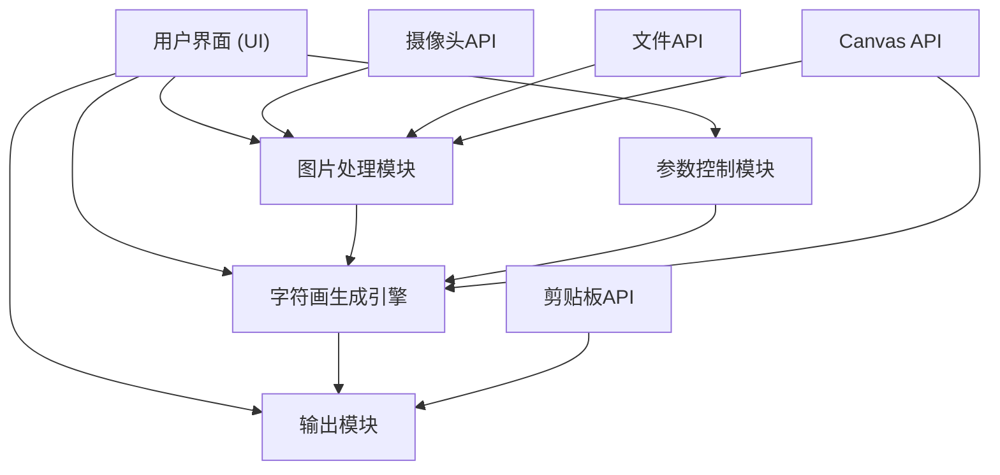

## 1. 架构设计

纯前端单页应用，所有处理在浏览器端完成，无需后端服务。



## 2. 技术选型

- **前端框架**：React@18 + TypeScript
- **构建工具**：Vite
- **样式方案**：TailwindCSS@3 + CSS变量
- **核心技术**：
  - Canvas API：图片缩放、像素读取
  - MediaDevices API：摄像头访问
  - Clipboard API：复制到剪贴板
  - File API / Blob API：文件下载
- **部署方式**：纯静态页面，可部署到任意静态托管服务

## 3. 项目结构

```
src/
├── components/
│   ├── Header.tsx          # 页面头部
│   ├── ImageUploader.tsx   # 图片上传组件
│   ├── CameraCapture.tsx   # 摄像头拍照组件
│   ├── AsciiPreview.tsx    # 字符画预览组件
│   ├── ControlPanel.tsx    # 控制面板组件
│   ├── Editor.tsx          # 字符画编辑器
│   └── ActionBar.tsx       # 操作按钮栏
├── hooks/
│   ├── useImageProcessor.ts # 图片处理Hook
│   └── useAsciiGenerator.ts # 字符画生成Hook
├── utils/
│   ├── charSets.ts         # 字符集定义
│   └── pixelUtils.ts       # 像素处理工具
├── types/
│   └── index.ts            # 类型定义
├── App.tsx
├── main.tsx
└── index.css
```

## 4. 核心数据类型

```typescript
// 字符集类型
interface CharSet {
  id: string;
  name: string;
  chars: string;
}

// 生成参数
interface GeneratorParams {
  width: number;        // 字符宽度
  charSetId: string;    // 字符集ID
  contrast: number;     // 对比度 0-200，默认100
  invert: boolean;      // 是否反色
}

// 图片状态
interface ImageState {
  source: ImageData | null;
  originalWidth: number;
  originalHeight: number;
}
```

## 5. 字符画生成算法

1. **图片缩放**：使用Canvas将图片缩放到指定字符宽度，高度按比例计算
2. **亮度计算**：对每个像素计算相对亮度 `L = 0.299*R + 0.587*G + 0.114*B`
3. **对比度调整**：应用对比度公式 `L' = (L - 128) * contrast/100 + 128`
4. **字符映射**：将亮度值 (0-255) 映射到字符集索引
5. **反色处理**：如启用反色，反转亮度值后再映射
6. **行拼接**：按行拼接字符，生成最终字符串

## 6. 性能优化策略

- **节流处理**：滑块调节时使用requestAnimationFrame节流，避免过度重绘
- **离屏Canvas**：使用离屏Canvas进行图片处理，不阻塞主线程
- **懒加载**：摄像头模块按需初始化，减少初始加载时间
- **虚拟滚动**：大尺寸字符画考虑虚拟滚动（可选优化）
